# Тестування працездатності системи

## Сценарії User

### GET /users
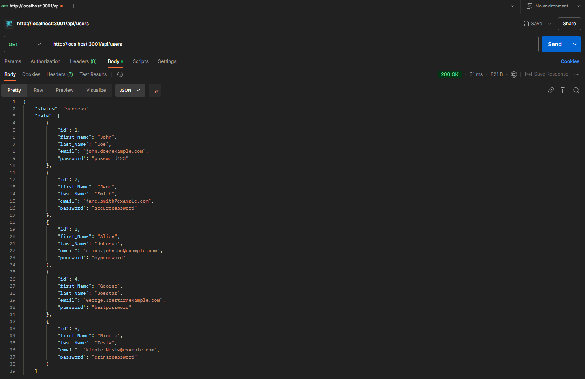

### GET /users/:id
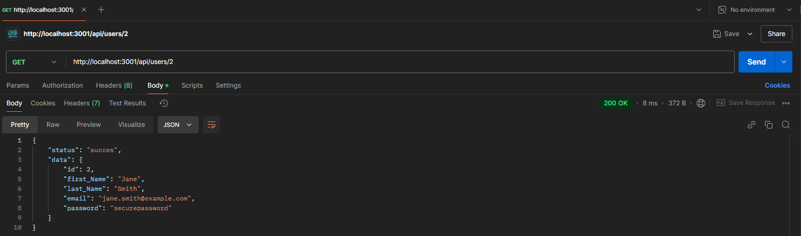

### POST /users
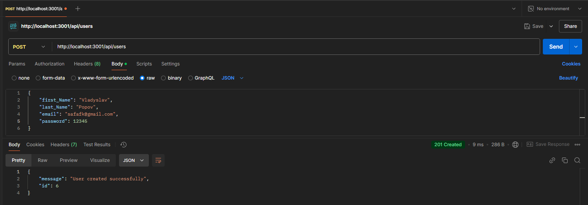

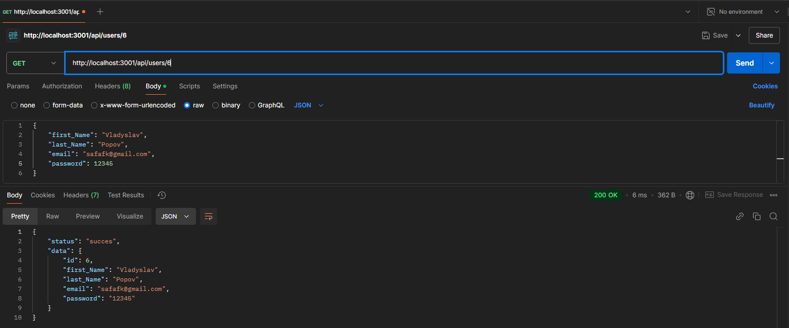

### PUT /users/:id
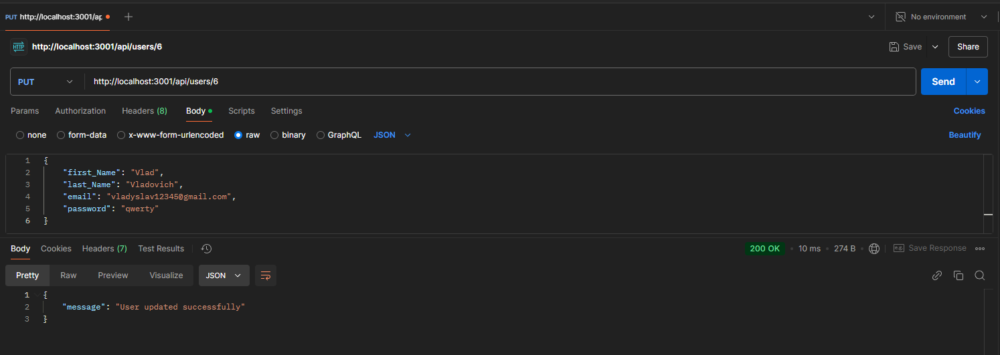

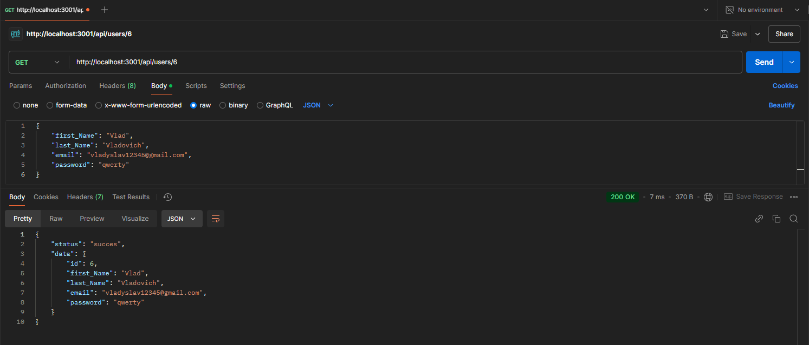

### DELETE users/:id
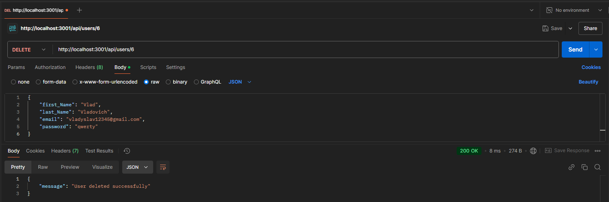

### ERROR 404 Not Found
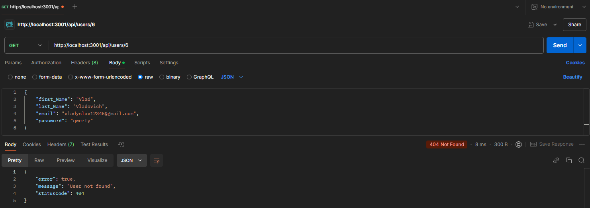

## Сценарії Media та Role працюють за таким же принципом

### GET /media
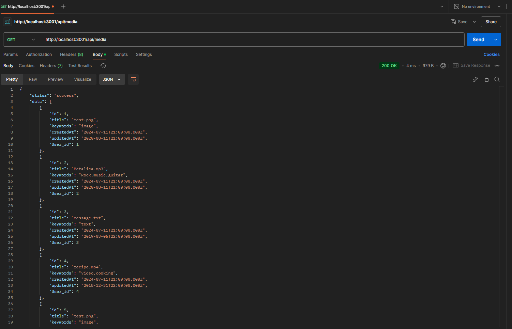

### GET /media/:id
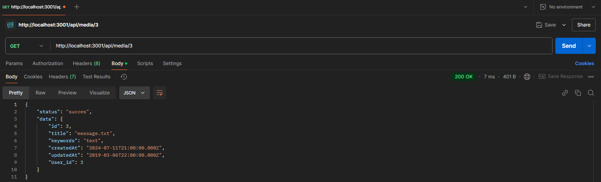

### POST /media
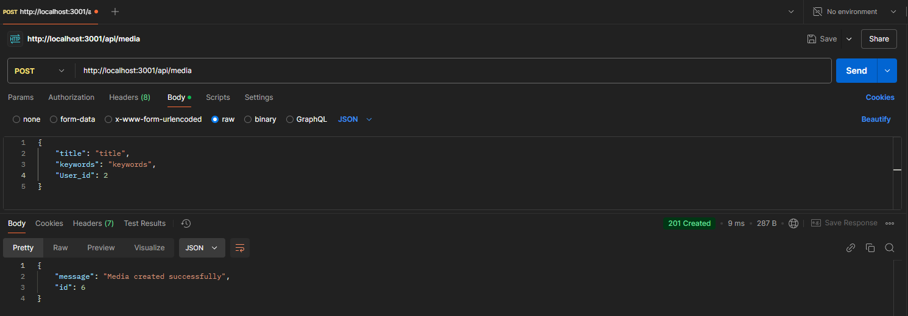

### PUT /roles/:id
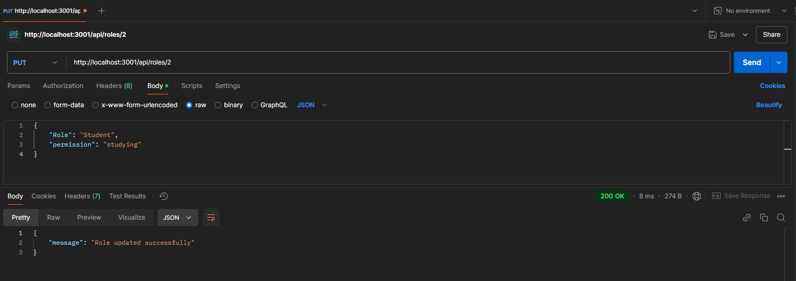

### GET /roles
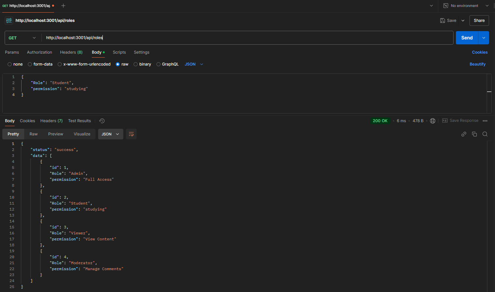

### DELETE roles/:id
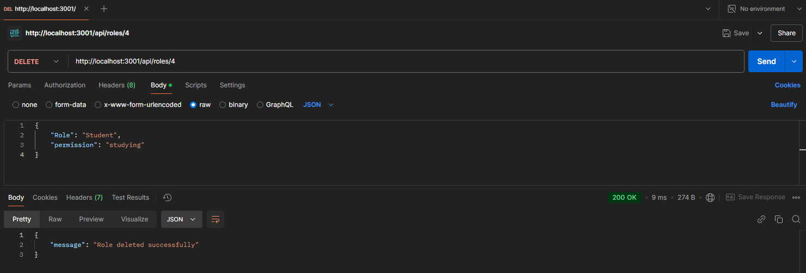

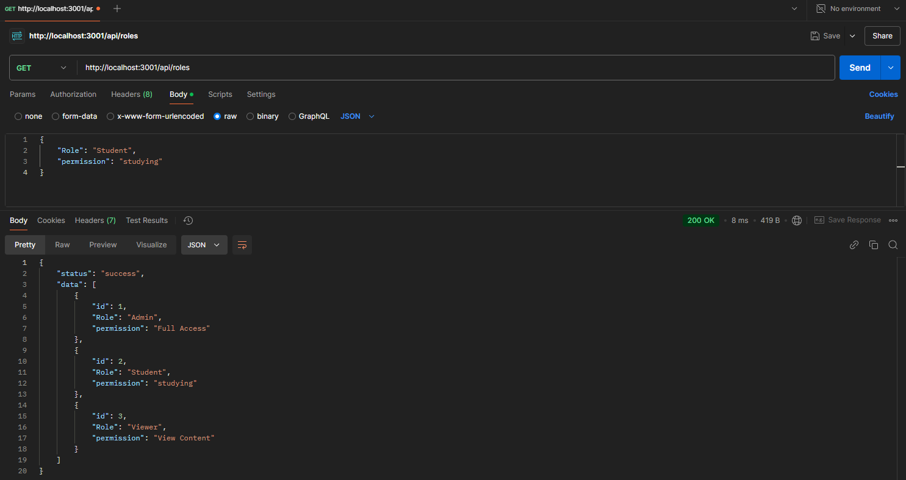

### ERROR 400 Bad Request 
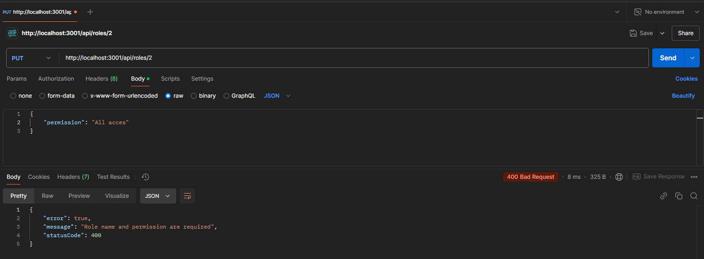
